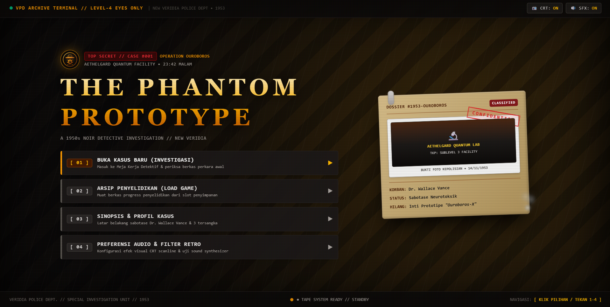
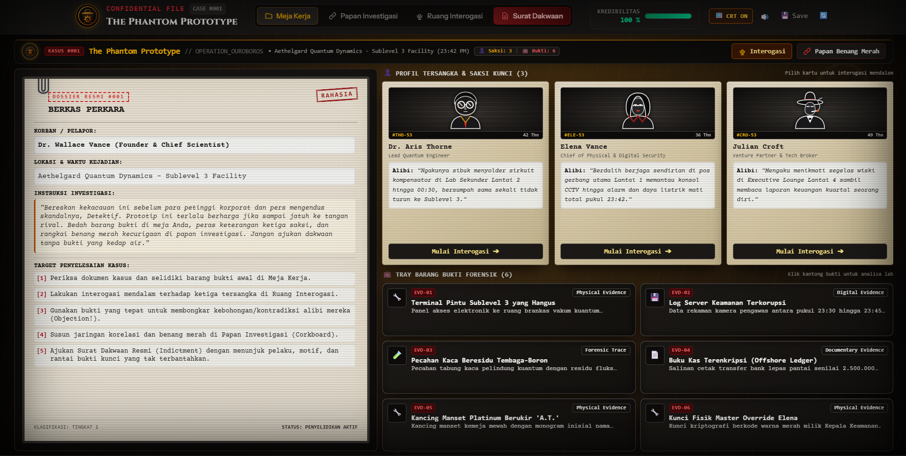
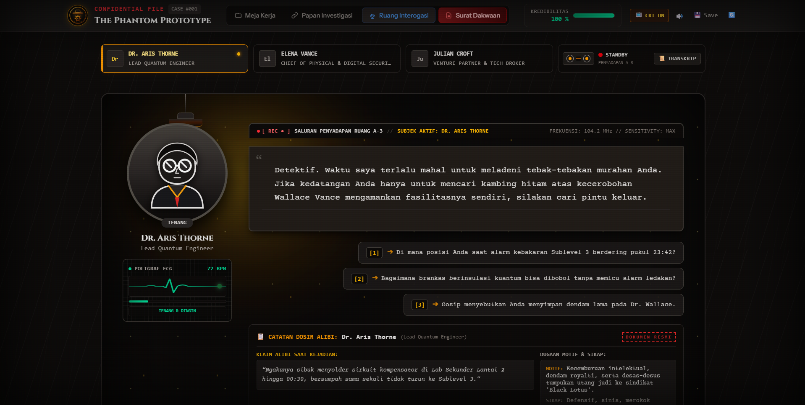
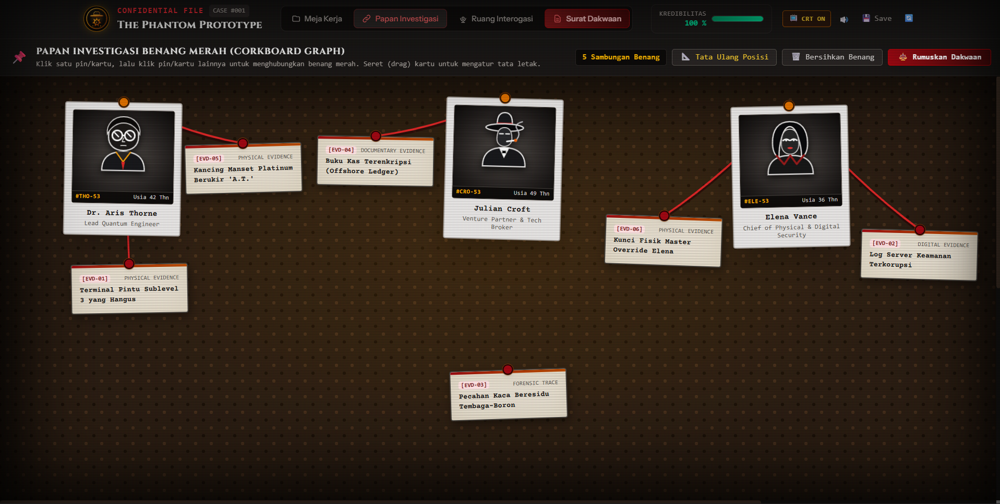

# The Phantom Prototype // Noir Archive


**1950s Retro-Noir Detective Investigation Game Powered by Flat-File Architecture**  
*Delivering an authentic analog deduction experience with diegetic UI, real-time polygraph interrogation, and a dynamic red-string evidence board.*


-10B981?style=for-the-badge)
-success?style=for-the-badge)


---

## 📸 Showcase & Preview Gallery

### 1. Start Menu & Teletype Terminal

The primary investigation portal featuring a retro teletype terminal interface, confidential manila case dossier, banker desk ambient glow, and atmospheric procedural cigar smoke.



---

### 2. Detective Work Desk & Case Dossier

The central command station with a 100% viewport-locked layout (zero vertical scrollbars). Features a paperclipped physical case file, vintage suspect index cards, and a forensic evidence tray with sealed Chain of Custody labels.



---

### 3. Interrogation Room & Dynamic Polygraph Oscilloscope

Intense face-to-face interrogation room with real-time polygraph ECG simulation, live contradiction detection, wiretap telephone transcripts, and an interactive Objection mechanics system.



---

### 4. Investigation Board (Dynamic SVG Corkboard)

An interactive corkboard to connect suspect pins, physical evidence, and motives using dynamic SVG vector yarn lines.



---

## 🔍 Case Synopsis: CASE_001 (Operation Ouroboros)

> *"November 14, 1953, 23:42 PM. The underground research complex of Sublevel 3 at Aethelgard Quantum Dynamics is rocked by a high-level sabotage incident. Chief Quantum Scientist, Dr. Wallace Vance, is found deceased beside a scorched vacuum vault terminal. The revolutionary prototype core 'Ouroboros-X' has vanished without a trace."*

### Key Suspects & Witnesses

1. **Dr. Aris Thorne (Lead Research Physicist - Age 44)**
   - Claims he was soldering a compensator circuit in the secondary lab on Level 2 until 00:30, swearing he never set foot in Sublevel 3.
2. **Elena Vance (Chief of Physical & Digital Security - Age 29)**
   - Victim's daughter. Claims she was on solo duty at the Level 1 main gate monitoring security consoles until the power failed at 23:42.
3. **Julian Croft (Aethelgard Financial Director - Age 52)**
   - Claims he was enjoying a private glass of whiskey at the Executive Lounge on Level 4 while reviewing quarterly financial reports alone.

---

## ⚡ Architecture & Core Highlights

- **Zero-Database Architecture (Flat-File JSON):**
  All case configurations, lore files, interrogation dialogue trees, evidence registries, indictment rules, and save/load slots operate purely on structured JSON files inside `storage/app/cases/` without external database servers.
- **Diegetic Vintage UI & 100% Viewport Locked:**
  The entire UI resembles authentic 1950s detective stationery (metal-clipped manila paper, police archive index cards, lab-sealed evidence bags). All pages are locked to a single screen fit (zero vertical scrollbars) on 1080p and 1366x768 displays.
- **Procedural Web Audio API Synthesizer:**
  Authentic vintage sound effects synthesized procedurally via Web Audio API (typewriter key clatter, oscilloscope hum, polygraph pulses, paper rustling, rotary clicks, and heavy gavel strikes) backed by strict autoplay gesture protection.
- **Dynamic Real-Time SVG Corkboard:**
  Interactive canvas for linking evidence nodes and suspects via reactive SVG calculations without external charting dependencies.
- **GPU-Accelerated Retro CRT Scanlines:**
  Authentic CRT tube raster filter with micro chromatic aberration and vignette curves isolated on an independent GPU composite layer to preserve 60 FPS performance while keeping micro-text legible.

---

## 🛠️ Tech Stack

| Component | Technology | Description |
| :--- | :--- | :--- |
| **Backend Core** | [Laravel 12](https://laravel.com) | Modern PHP framework with Service-Action pattern |
| **Runtime** | PHP 8.2+ | High-performance server-side execution |
| **Styling & Theme** | [Tailwind CSS v4](https://tailwindcss.com) | Modular `@import` architecture (theme, utilities, animations) |
| **Reactivity** | [Alpine.js 3.x](https://alpinejs.dev) | Reactive global store and lightweight component interactions |
| **Audio Engine** | Web Audio API | Procedural audio synthesis without large static assets |
| **Vector Graphics** | Native Inline SVG | High-resolution suspect mugshots and dynamic yarn lines |
| **Testing Suite** | PHPUnit | Automated tests for case repository, contradiction engine, and state |

---

## 🚀 Local Installation Guide

Ensure your development environment meets the following requirements: **PHP >= 8.2**, **Composer >= 2.x**, and **Node.js >= 18.x**.

### 1. Clone Repository

```bash
git clone https://github.com/NDVERS/noir-archive.git
cd noir-archive
```

### 2. Install Dependencies

```bash
# Install PHP dependencies
composer install

# Install Frontend dependencies
npm install
```

### 3. Environment Setup

```bash
# Duplicate environment file
cp .env.example .env

# Generate application key
php artisan key:generate
```

### 4. Build Frontend Assets

```bash
# Compile production bundle
npm run build

# Or launch Vite development server
npm run dev
```

### 5. Run Local Server

```bash
php artisan serve
```

Open your browser and navigate to: `http://127.0.0.1:8000`

---

## 🧪 Automated Test Suite

The project includes 26 automated unit and feature tests covering controller endpoints, testimony contradiction rules, indictment evaluation, and save slot integrity:

```bash
php artisan test
```

**Test Execution Output:**

```text
   PASS  Tests\Unit\ExampleTest
  ✓ that true is true

   PASS  Tests\Feature\CaseRepositoryTest
  ✓ it loads case info correctly
  ✓ it returns all available cases
  ✓ it handles non existent case safely
  ✓ it bundles initial case data correctly

   PASS  Tests\Feature\CheckContradictionActionTest
  ✓ it validates successful contradiction
  ✓ it rejects incorrect evidence contradiction
  ✓ it rejects contradiction when evidence has no claim

   PASS  Tests\Feature\EvaluateAccusationActionTest
  ✓ it validates correct accusation solution
  ✓ it fails accusation with wrong culprit
  ✓ it fails accusation with missing required evidence
  ✓ it calculates credibility penalties correctly

   PASS  Tests\Feature\GameControllerTest
  ✓ it renders start menu welcome page
  ✓ it renders detective work desk page
  ✓ it renders investigation corkboard page
  ✓ it renders suspect interrogation page
  ✓ it checks testimony contradiction via api
  ✓ it evaluates case indictment accusation via api
  ✓ it handles save game state via api
  ✓ it loads game state via api
  ✓ it resets game progress via api

   PASS  Tests\Feature\SaveManagerServiceTest
  ✓ it lists save slots correctly
  ✓ it saves and retrieves game state
  ✓ it updates existing save slot
  ✓ it creates initial save when empty
  ✓ it resets game save state safely

  Tests:    26 passed (111 assertions)
  Duration: 2.15s
```

---

## 📂 Case Directory Structure (Flat-File Engine)

```text
storage/app/cases/case_001/
├── case_info.json    # Case metadata, incident briefing, victim, and objectives
├── suspects.json     # Full suspect dossiers, roles, alibis, and physical traits
├── evidences.json    # Forensic evidence records, lab tags, categories, and findings
├── dialogues.json    # Interrogation trees, wiretap logs, and contradiction bindings
└── solution.json     # Solution truth key, scoring penalties, and verdict outcomes
```

---

## 📜 License

Distributed under the [MIT License](LICENSE). Free for educational and non-commercial exploration.
